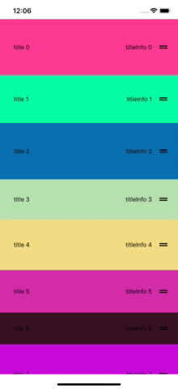

## About
Rearrange items in a flatlist
- Capable of **rearranging items** of **arbitary height**.
- an improvement/extension of Ben Awad's implementation. https://github.com/benawad/drag-and-drop-flatlist.
- hold the icon, , to move an item.

## Demo:


## To Run
In root of the directory execute the following:
```
Yarn
Yarn Start
```